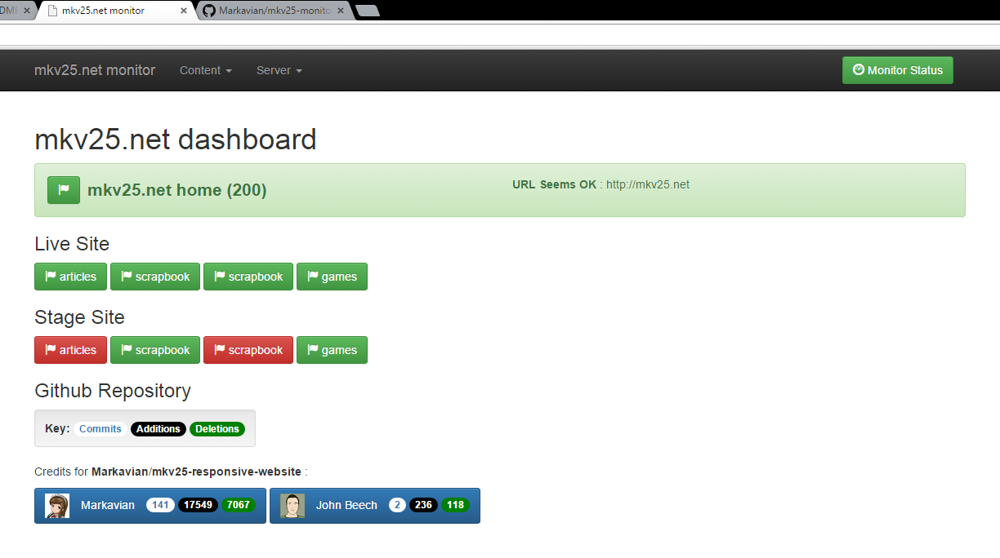

mkv25.net monitor
=================

What it looks like
------------------



Setting up
----------

To install and run, clone this repository, then run:
```
npm install
node server.js
```

Expected output:
```
[Startup Check] User content directory seems to exist: monitoring

[Startup Check] Content directory seems to exist: monitoring/content

[Startup Check] API directory seems to exist: monitoring/api

[All Checks Complete]

mkv25.net monitor Server started on http://localhost:2500
```
